[toc]

# 开源ChatLLM-research

## 1、调研情况

主要针对近期开源Chat类模型进行数据集收集、模型效果调研、论文实现初探。

两个模型排行榜：

国内：[SuperCLUE琅琊榜](https://www.superclueai.com/)

国外：[UC伯克利LLM排行榜](https://chat.lmsys.org/)

### 1.1 模型情况梳理
| 模型名称           | 基座模型                                                     | 能力说明                                  | 优缺点                                                       | 训练预期需要资源                     | 微调数据集                                                   | 推理需要资源                      | 论文中的评估结果                                             | github                                                       | 论文                                                         | 训练中值得关注                                               |
| :----------------- | :------------------------------- | :-------------------------------- | :-------------------------------- | :-------------------------------- | :-------------------------------- | :-------------------------------- | :-------------------------------- | :-------------------------------- | :-------------------------------- | :-------------------------------- |
| Guanaco-65B        | LLaMA                                                        | 65B能达到ChatGPT的99%表现（人工和GPT4评估） |                                                              | 24hours fintune 65B on a 48GB GPU    | 论文对比了8个数据集： OASST1，HH-RLHF ，Alpaca，self-instruct， unnatural instructions，FLAN v2，Chip2, Longform   最后选择OASST1中top reply的9k条数据微调得到Guanaco |                            | 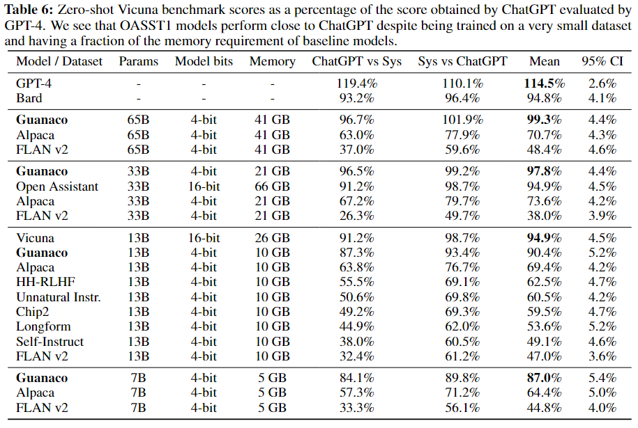除13B尺寸上的Vicuna表现更好外，Guanaco表现最优 | [相关代码](https://github.com/artidoro/qlora)                | [相关论文1](https://arxiv.org/abs/2305.14314)                | Train on target优于Train on source and target                |
| Vicuna-13B         | LLaMA                                                        | ChatGPT的92%（GPT4评估）                  |                                                              | FSDP on 8 A100 GPUs in one day       | 从[ShareGPT](https://sharegpt.com/) 清洗出70K user-shared ChatGPT conversations（ShareGPT目前已关闭开源，仅有用户提前下载的部分数据，[数据清洗代码](https://github.com/lm-sys/FastChat/blob/main/docs/commands/data_cleaning.md)） | 28GB of GPU memory for Vicuna-13B | 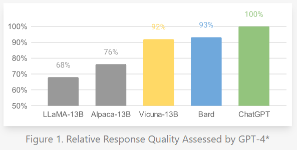评估数据集为80条 vicuna test，GPT4进行评估打分 | [相关代码](https://github.com/lm-sys/FastChat) [在线demo](https://chat.lmsys.org/) | [官方博客](https://lmsys.org/blog/2023-03-30-vicuna/)        | 多轮对话只计算模型输出的loss                                 |
| Alpaca             | LLaMA                                                        | 约ChatGPT的70%                            | chat类模型中比较早期的做法                                   | 在4 A100 80G GPUs in FSDP mode微调7B | Self-instruct from davinci-003 API (52k samples)             |                                   |                                                              | [相关代码](https://github.com/tatsu-lab/stanford_alpaca)     | [官方博客](https://crfm.stanford.edu/2023/03/13/alpaca.html) |                                                              |
| LLaMA_GPT4-7B      | LLaMA                                                        | 好于Alpaca-13B、逊于Vicuna-13B            | 进行中文微调：Alpaca的52k instructions 翻译成中文后用GPT-4生成answer | 16*V100                              | 使用GPT-4根据Alpaca的52k instructions 生成新的answer             |                                   | 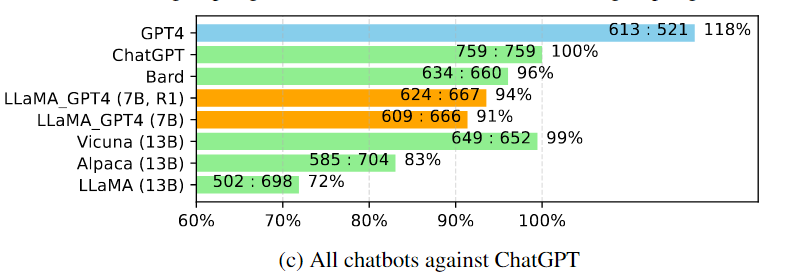中文表现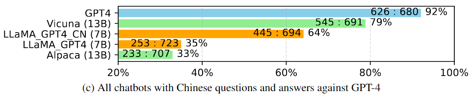 | 同Alpaca代码                                                 | [相关论文1](https://arxiv.org/abs/2304.03277)                |                                                              |
| Koala | LLaMA |      |      |      | 两类数据： 1、ChatGPT Distillation Data:SharGPT中删除非英文的，保留30k条；Human ChatGPT Comparison Corpus（HC3） 2、Open Source Data：Open Instruction Generalist（OIG）、Alpaca、HH-RLHF、OpenAI WebGPT、OpenAI summarization |      | 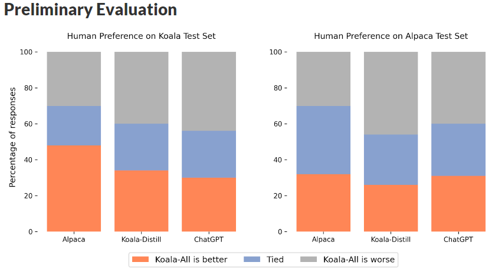 | [相关代码](https://github.com/young-geng/EasyLM)   [数据处理代码](https://github.com/young-geng/koala_data_pipeline) | [官方博客](https://bair.berkeley.edu/blog/2023/04/03/koala/) | 论文用ChatGPT Distillation Data微调了Koala-Distill，用所有数据微调了Koala-All，结果显示在两个验证数据集上，Koala-Distill结果都好于Koala-All（虽然差距不明显） |
| SelFee             | LLaMA                                                        | SelFee-13B约ChatGPT的103%                 | 自我反馈提升回答效果                                         |                                      | 178k 数据包含自我反馈和修订数据：1、Alpaca 52k（根据instructions让ChatGPT生成feedback数据、未开源） 2、Math collection 26k 3、Code collection 30k 4、FLAN collection 16k 5、ShareGPT 55k（去除非英语） |                                   | 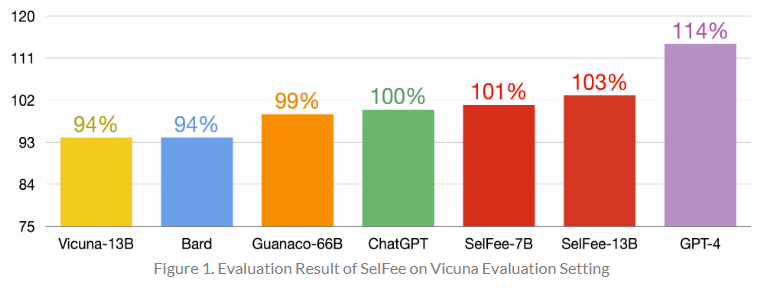用80条 vicuna test评估 | 同Alpaca代码   [在线demo](https://kaistai.github.io/SelFee/demo) | [官方博客](https://kaistai.github.io/SelFee/)                | 多种训练数据、自我反馈链的模式                               |
| BELLE              | bloom、LLaMA                                                 | 约ChatGPT的92%（排除code和math）          | LLaMA基座模型对中文进行二次预训练微调数据集几乎全部为中文    | 8卡A100 80G                          | 200万中文+Alpaca的5万英文（均由ChatGPT产生）BELLE-13B基于LLaMA，训练数据达400万 |                                   | 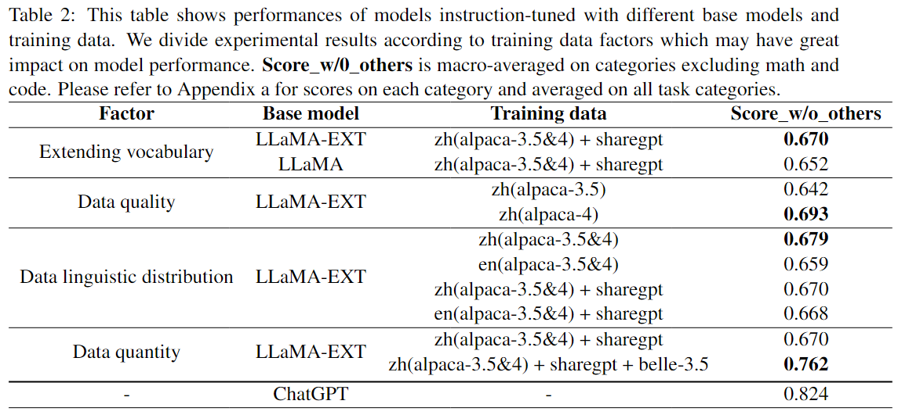LLaMA-EXT做了中文词表扩展并在3.5B中文token上二次预训练[测试集下载地址：1k中文评估测试集，可用ChatGPT自动打分](https://github.com/LianjiaTech/BELLE/tree/main/eval) | [相关代码](https://github.com/LianjiaTech/BELLE)             | [相关论文1](https://arxiv.org/abs/2304.07854)   [相关论文2](https://arxiv.org/abs/2304.08109) | 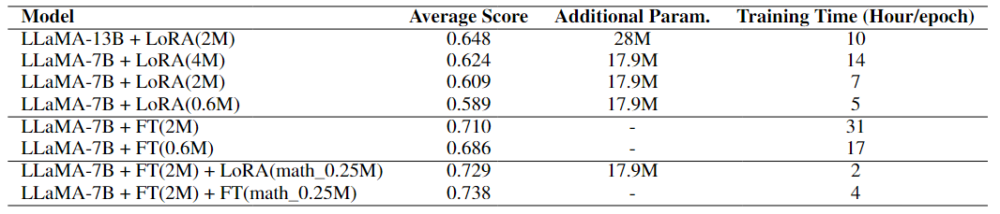对比不容模型尺寸、全量微调、LoRA、不同微调数据量的效果结论：全量FT>LoRA；微调数据越多越好；模型尺寸越大越好 |
| ChatGLM-6B         | GLM130B                                                      |                                           | 基座模型在中英（对半）语料上训练                             |                                      | 1T tokens的中英双语训练                                      |                                   | 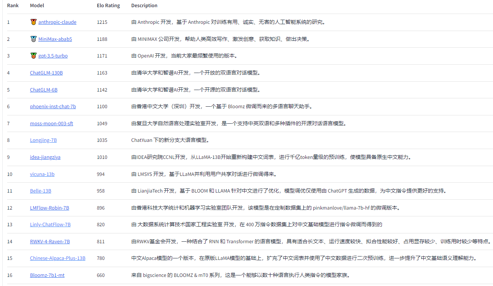参与用户与两个匿名模型同时聊天，并投票哪个更好，排名持续更新中 | [相关代码](https://github.com/THUDM/ChatGLM-6B)              | [GLM-130B相关论文](https://arxiv.org/abs/2210.02414)         |                                                              |
| Linly-ChatFlow     | Linly OpenLLaMA-13B（从头开始预训练，100G中英语料，Apache 2.0开源） |                                           | 另有基座模型Linly-Chinese-LLaMA-33B（最大的开源中文LLaMA模型，二次预训练30G，无中文词表扩充：原始700个汉字） |                                      | 1.BELLE: 150万数据，175个指令seed 2.pCLUE: 120万训练数据，73个Prompt 3.CSL: 40万中文论文元数据，26个Prompt 5.GuanacoDataset: 多语言指令数据集 6.Chain-of-Thought: 中英文思维链数据 7.news_commentary: 中英文翻译数据 8.firefly: 23个中文NLP任务集合 |                                   |                                                              | [相关代码](https://github.com/CVI-SZU/Linly)   [在线demo](https://huggingface.co/spaces/Linly-AI/Linly-ChatFlow) |                                                              |                                                              |
| Chinese-Alpaca-13B | Chinese-LLaMA（[LoRA权重地址](https://huggingface.co/ziqingyang/chinese-llama-plus-lora-13b)） |                                           | LLaMA在120G中文语料上的二次预训练、扩充中文词表（LoRA）      |                                      | 基于LoRA：基座模型训练120G通用中文语料Chinese-Alpaca在4.3M中文指令上微调 |                                   |                                                              | [相关代码](https://github.com/ymcui/Chinese-LLaMA-Alpaca/tree/main) | [相关论文](https://arxiv.org/abs/2304.08177)                 |                                                              |
| Firefly流萤        | bloom                                                        |                                           | 裁切词表大小（适应中文）                                     |                                      |                                                              |                                   |                                                              | [相关代码](https://github.com/yangjianxin1/Firefly)          |                                                              |                                                              |
| InstructUIE        | Flan T5                                                      |                                           | 信息抽取任务+中模型                                          |                                      |                                                              |                                   |                                                              | [相关代码](https://github.com/BeyonderXX/InstructUIE)        | [相关论文](https://arxiv.org/abs/2304.08085)                 |                                                              |
|                    |                                                              |                                           |                                                              |                                      |                                                              |                                   |                                                              |                                                              |                                                              |                                                              |

### 1.2 邻域模型情况

| 模型名称     | 基座模型 | 邻域实现方法                                                 | 相关论文                                     | 相关代码                                                |
| :----------- | :------- | :----------------------------------------------------------- | :------------------------------------------- | :------------------------------------------------------ |
| Lawyer LLaMA | LLaMA    | 1、通用语料预训练LLaMA，增强中文能力 2、中文法律语料continual training 3、指令微调：通用指令（Alpaca-GPT4，中英文）；法律指令微调（ChatGPT生成法律考题、咨询等答案、检索法条后让ChatGPT生成答案）  | [相关论文](https://arxiv.org/abs/2305.15062) | [github地址](https://github.com/AndrewZhe/lawyer-llama) |

补充说明：

LLaMA的词表中只有几百个中文token

阿联酋有一个Falcon-40B基座模型，但是词表中没有中文token

其他国产开源模型：

- CPM-Bee-10B：百亿参数、中英双语基座模型
- Chatyuan-large-v2

### 1.3 总结
#### a) 基座模型
##### LLaMA

包含65B、33B、13B、7B等尺寸

缺少中文token，解决措施：

+ a) 扩充词表、二次预训练，相关模型：Chinese-Alpaca-13B（LoRA）。其他BELLE对LLaMA做了词表扩充和二次预训练，但是并没有开源调整后的基座模型；

+ b) 从头训练，相关模型：Linly OpenLLaMA-13B（已开源）、智源Aquila在中英语料上进行从头训练，目前开源基座模型7B，将开源33B；

##### GLM

包含130B（[申请下载链接](https://github.com/THUDM/GLM-130B)）、10B等尺寸

在中文语料上预训练，缺少中间尺寸的开源模型

##### bloom和bloomz

多语言模型，词表太大，需要做裁切（Firefly项目有进行裁切）

#### b) 微调数据和模型效果

**数据质量**

ChatGPT>Vicuna-13B>LLaMA_GPT4>Alpaca。

其中最大的差异就是微调数据集的质量，Vicuna-13B使用ShareGPT，用户分享的和ChatGPT聊天的数据，Alpaca使用52k ChatGPT self instruct得到的数据，而LLaMA_GPT4使用52k GPT-4 self instruct得到的数据。得出结论，微调数据集中有人参与的由于GPT-4，优于ChatGPT。

所以在后续Chat模型中，不少模型使用了有人工参与介入的数据集，主要有：HH-RLHF、OASST1、databricks-dolly-15k、ShareGPT、HC3、openai/summarize-from-feedback等。

然而，在Koala模型实验中，他们训练了两个模型：Koala-Distill和Koala-All，其中Koala-Distill只用了ChatGPT相关数据集，反而在两个验证数据集上优于Koala-All（提升不多）。推测可能得原因，ChatGPT生成的数据更符合验证集数据分布，另外有些开源NLP数据集虽然也可以转化成QA进行微调，可能和用户真正聊天的分布有差异。

经过简短的调研，目前开源chat模型在sft微调阶段使用的数据集有不少重合的数据，可能仅靠sft数据，目前这些模型已经到达天花板了？但是在另外一些方面，不少模型也做了尝试，比如QLoRA可以用40G显卡微调65B模型，这样可以通过模型尺寸来突破上限。还比如SelFee在微调数据中引入self-feedback等机制。

**CoT、self-feedback、Reason-Act、autoGPT的加入**

SelFee使用Alpaca 52k instructions让ChatGPT生成带自我反馈的语料进行微调，并在推理阶段同样引入反馈链条，取得了不错的效果。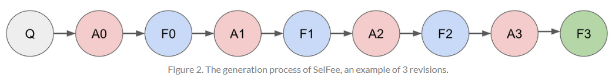

## 2、数据集收集

### 2.1 微调数据

| 数据集                                 | 数据集用途             | 原始来源                                                     | 其他补充说明                                                 |
| :------------------------------------- | :--------------------- | :----------------------------------------------------------- | :----------------------------------------------------------- |
| OASST1                                 | 微调Guanaco            | [下载地址](https://huggingface.co/datasets/OpenAssistant/oasst1) | 10万条对话树、35种语言、人工生成、人工标注（1万多志愿者）    |
| HH-RLHF                                | Guanaco、RedPajama     | [下载地址](https://huggingface.co/datasets/Anthropic/hh-rlhf) | Anthropic的RLHF数据，可以微调，也可以训练reward model        |
| databricks-dolly-15k                   | Dolly2、RedPajama      | [下载地址](https://huggingface.co/datasets/databricks/databricks-dolly-15k) | Databricks员工众包生成的提示/回答                                                             |
| ShareGPT                               | 微调Vicuna、SelFee     | 数据关闭开源（[用户提前下载后分享1](https://huggingface.co/datasets/RyokoAI/ShareGPT52K)）（[用户分享下载2](https://huggingface.co/datasets/anon8231489123/ShareGPT_Vicuna_unfiltered)） | 个人用户分享和ChatGPT的对话                                  |
| Alpaca                                 | 微调Alpaca等多模型     | [下载地址](https://github.com/tatsu-lab/stanford_alpaca/blob/main/alpaca_data.json) | 52k self instruct数据                                        |
| Alpaca-3.5-zh                          | 中文Alpaca             | [项目地址](https://github.com/ymcui/Chinese-LLaMA-Alpaca/tree/main) | ChatGPT翻译的52k Alpaca                                      |
| Alpaca_gpt4_data                       | 微调LLaMA_GPT4         | [下载地址](https://github.com/Instruction-Tuning-with-GPT-4/GPT-4-LLM/tree/main/data) | 根据Alpaca的52K instructions用GPT4生成answer（中英两版），另外下载地址中还包含GPT4对3个模型生成答案的排序打分数据，可以训练reward model |
| AQuA                                   | 微调Selfee             | [下载地址](https://github.com/deepmind/AQuA)                 | 数学数据集                                                   |
| Flan collection                        | Flan-PaLM、Selfee      | [下载地址](https://github.com/google-research/FLAN/tree/main/flan/v2) | 包含5个数据集                                                |
| Linly instructions                     | 微调Linly-ChatFlow     | [下载地址](https://github.com/CVI-SZU/Linly/tree/main/instructions) | 1.BELLE: 150万数据，175个指令seed 2.pCLUE: 120万训练数据，73个Prompt 3.CSL: 40万中文论文元数据，26个Prompt 5.GuanacoDataset: 多语言指令数据集 6.Chain-of-Thought: 中英文思维链数据 7.news_commentary: 中英文翻译数据 8.firefly: 23个中文NLP任务集合 |
| BELLE 10M                              | 微调BELLE、Linly       | [下载地址](https://github.com/LianjiaTech/BELLE/tree/main/data/10M#multiturn-chat) | 持续开放的由ChatGPT产生的数据集                              |
| Firefly_train_1.1M                     | 微调Firefly            | [下载地址](https://huggingface.co/datasets/YeungNLP/firefly-train-1.1M) | 收集23个常见中文数据集，对于每个任务，由人工书写若干种指令模板，保证数据的高质量和丰富度，数据量为115万 |
| awesome-open-instruct-data-for-chinese | 中文指令金条数据集合集 | [下载地址](https://github.com/LianjiaTech/BELLE/blob/main/data/awesome_open_instruct_data_for_chinese.md) | 包含多个中文指令数据集                                       |
| BAAI-OL-CC                             |                        | [下载地址](https://data.baai.ac.cn/details/OL-CC)            | 智源通过众包，人工标注的10k条中文对话数据                            |
| summarize-from-feedback         | 微调koala              | [下载地址](https://github.com/openai/summarize-from-feedback/tree/master) | Openai的90k英文数据                                                      |
| HC3                                    | 微调koala              | [下载地址](https://github.com/Hello-SimpleAI/chatgpt-comparison-detection) | 中英文，同一个问题，对比human vs chatgpt的答案               |         
| openai/WebGPT | 微调WebGPT、Koala | [下载地址](https://openaipublic.blob.core.windows.net/webgpt-answer-viewer/comparisons.jsonl) | openai开源，微调WebGPT             |
| OIG           | 微调Koala         | [下载地址](https://huggingface.co/datasets/laion/OIG)        | LAION发布的~43M instructuons数据集 |

### 2.2 预训练数据

| 数据集              | 数据集用途                         | 原始来源                                                     | 其他补充说明                            |
| :------------------ | :--------------------------------- | :----------------------------------------------------------- | :-------------------------------------- |
| OpenLLaMA预训练语料 | 中英预训练语料100GB                | [下载地址](https://github.com/CVI-SZU/Linly/wiki/Linly-OpenLLaMA) | 20G中文语料、10G平行语料、70G英文语料   |
| RedPajama-Data      | 复刻LLaMA预训练语料（1.4T tokens） | [下载地址](https://github.com/togethercomputer/RedPajama-Data) | 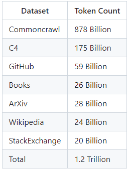 |

### 2.3 信息抽取数据集
| 数据集                 | 数据集简介                        | 原始来源                                                     |
| :--------------------- | :-------------------------------- | :----------------------------------------------------------- |
| BAAI-FewRel            | 英文信息抽取数据                  | [下载地址](https://data.baai.ac.cn/details/FewRel)           |
| IE INSTRUCTIONS        | 英文信息抽取数据，训练instructUIE | [下载地址](https://drive.google.com/file/d/1T-5IbocGka35I7X3CE6yKe5N_Xg2lVKT/view) |
| DuIE                   | 中文                              | [下载地址](https://hyper.ai/datasets/16618)                  |
| 金融信息负面及主体判定 | 中文                              | [下载地址](https://www.datafountain.cn/competitions/353/datasets) |
|                        |                                   |                                                              |